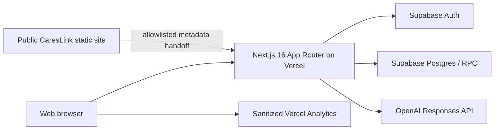

# CaresLink AI Architecture

> Status: **Current-state architecture**, audited 2026-08-16; isolated database evidence updated 2026-08-26.
> Delivery phase: **Implementation Readiness / local Preview shadow slice**.
> This file does not claim that Product Baseline V1.0 is available in Production.

## Intended-state baseline

The approved product intent is defined by the planning-workspace files:

- `docs/2026-08-09-careslink-v1-product-baseline-approval.zh.md`
- `docs/2026-08-09-careslink-app-v1-requirements-review.zh.md`
- `docs/2026-08-09-careslink-ai-requirements-review.zh.md`

The requirement-by-requirement implementation assessment is in
`documentation/v1-implementation-readiness-audit.zh.md`.

## Current runtime

- Repository application: `apps/careslink-ai`
- Production host: `https://ai.careslink.com.au`
- Audited production code: `f0d994dfc66d7373bbadbe106b3147d847c6c8d3`
- Production Supabase project: `adocsnwnslxhxcjgbyee`
- Current clients: responsive Web only. There is no iOS or Android application in the audited repository.
- Current Production runtime API surface remains the Next.js route handlers under `src/app/api`. The local source now also contains a shared `/v1` route adapter, request-scoped Supabase adapter, service-only active-session resolver, atomic privacy-review confirmation boundary and versioned OpenAPI shadow contract. Both application gates are off by default; the runtime additionally requires an exact non-Production Preview Supabase ref before creating any privileged or user-session client. Privacy issuance uses a dedicated Preview-only service client and never falls back to the generic service-role variable. Document write-RPC grants remain withheld, and the flow has not been served or E2E-verified in Production.
- The local source also contains default-off Portal Referral intake, source-detail, Assignment M1a and Provider Response M1b runtimes. They use a request-scoped cookie Supabase client and separate database authorization for source intake/detail, operator queue/detail/triage/candidates/offer, and an approved provider's metadata-only offer inbox plus atomic accept/decline. Assignment offer leaves `assigned_provider_id` null; Provider Response sets it only on acceptance. None of these Portal slices is part of the current Production deployment or enabled on a retained Preview; the exact M1b Hosted target described below was disposable and has been deleted.

## Current product domains

### Auth and roles

Supabase Auth provides email/password and feature-gated Google OAuth. The Web callback exchanges the PKCE code for a cookie-backed session. Application roles are read from trusted `app_metadata`; user-editable metadata is not accepted as an admin grant.

Current roles are `provider` and `admin`. Demo identities can exist only through the non-production demo flag. There is no Microsoft/Apple identity, identity-linking workflow, device/session registry, native SecureStore contract, or high-risk reauthentication service.

### AI Documents

The only production AI Note workflow is NDIS Case Note Companion:

1. Provider session is checked before request body parsing or cost-bearing work.
2. Browser performs a first privacy review; pasted source text stays in React state.
3. Server independently validates minimum facts, confirmations and obvious identifiers.
4. Server reserves one legacy credit and consumes account/IP abuse quota.
5. Server calls the OpenAI Responses API with strict structured output and `store:false`.
6. A short-lived opaque claim is persisted before the credit is committed.
7. The provider can save the result to `generated_material_drafts` and later read/delete it as owner.

This is a synchronous request flow. It is not a canonical document/revision model and has no live database-backed durable generation job, editor checkpoint, self-review, DOCX/PDF/TXT export or cross-device outbox.

### Legacy provider and referral workspace

Profile, Readiness, referral materials, outreach and access-code capabilities remain in the same Web application. They are legacy Web domains and are not CaresLink App V1 entitlements. Their material types and access-code quota must remain isolated from the future personal Points wallet.

## Current data stores

| Store | Purpose | Current boundary |
|---|---|---|
| Supabase Auth | identities and sessions | trusted UUID and `app_metadata.role` |
| `generated_material_drafts` | flat saved AI/legacy material JSON | owner SELECT/DELETE; server save |
| `ndis_case_note_companion_claims` | opaque, short-lived generated-result handoff | service-role only; claim owner binding |
| `account_entitlements` | legacy free monthly allowance | owner SELECT; plan is currently `free` |
| `credit_ledger` | legacy grant/reserve/commit/release | append-only RPC writes; owner SELECT |
| `template_companion_quota_usage` | account/IP abuse counters | service-role only |
| `template_companion_events` | companion metadata telemetry | service-role only; no note body |
| provider/referral tables | legacy profile, access and outreach | server-owned paths with domain-specific checks |

All audited public tables have RLS enabled. RLS enabled alone is not proof of the V1 permission model: several target tables do not yet exist, and some legacy tables are accessed only through the service role.

## Implemented V1 shadow foundation

The first implementation-readiness batch is present in source but is deliberately inactive:

| Artifact | Implemented evidence | Runtime / deployment status |
|---|---|---|
| Versioned shared contract | `src/lib/v1/shared-contracts.ts` defines three locales, five Note codes/neutral fields, orthogonal states, service/rate codes, error codes and idempotency rules | only the audited NDIS save route may import the new integration entrypoint |
| Portal Referral intake, source-detail, Assignment M1a and Provider Response M1b runtimes | `portal-referral-runtime.server.ts`, `portal-referral-supabase.server.ts`, the Portal route adapter, dedicated assignment/provider controls and four operation migrations implement request-scoped cookie authorization, source list/create/detail, operator queue/detail/triage/candidates/offer and provider own-offer list/accept/decline | default-off source implementation with separate application and database operation gates. Provider Response adds `GET /api/portal/referral-offers`, `POST /api/portal/referral-offers/{matchId}/response` and three authenticated-only definer RPCs. Exact-one approved-provider authority is database-derived; the inbox is bounded and no-PII; accept/decline are actor+mutation serialized and receipt/audit hashed. Gate-on pages never fall back to mock, network uncertainty retains the same mutation key for reconciliation, and all five database flag rows default to `enabled=false, preview_only=true` in migration source. Assignment M1a retains its deleted exact-current Hosted Cookie evidence. M1b passed both the exact-current local PostgreSQL 16.15 minimum-chain/four-suite gate and, at exact source `cc1e53cc88666a3e3f18ac55058295db408535ee`, a deleted no-data Hosted gate on Preview ref `aupndcptwlqmjlgeifdj`: 33/33 migrations, 14/14 rollback suites and the real GoTrue SSR-cookie/Data API matrix. Teardown proved zero Auth/Portal fixture residue, deletion passed three absence probes and Production remained at 19 migrations. Private accepted detail, follow-up, notifications, audit list, document/export, deployment and activation remain absent. No retained Preview/runtime, Vercel deployment, merge, Production migration/write or activation exists, and no M1b test business data remains |
| Five-Note generation source foundation | `src/lib/v1/note-generation-output.ts` and `note-generation-job.ts` use one catalog dispatcher/provider port for Communication, Handover, Progress, NDIS and Incident Factual; validate bounded provider output; inject server-owned facts/disclaimer; hash canonical content; model version-bound queued/running/terminal jobs; and prove fake atomic job + document + revision-1 persistence | compile-time readiness is `false`; server-only, local memory evidence with no route, database-backed durable repository, registered worker, real provider/model/STT, Points settlement, export or Portal UI |
| Durable Note generation internal contract | `src/lib/v1/note-generation-durable.ts`, `note-generation-durable.test.ts` and `documentation/v1-note-generation-durable-design.md` define a server-internal metadata-only repository and memory fake for enqueue replay, attempt claim, lease renewal, fresh-authority-bound payload authorization, bounded recovery, stale-worker fencing, response-loss replay and atomic canonical revision-1 success | both durable readiness and payload-retention readiness are fixed `false`; source-only and default-off. A private RPC migration now exists in source, but no route, applied database repository, registered/deployed worker, payload vault, live Auth/privacy transaction, model/STT, Points or deployment exists |
| Note worker/provider/payload policy contracts | `note-generation-worker-policy.ts`, `note-generation-provider-policy.ts` and `note-generation-payload-contract.ts` define digest-bound immutable worker timing/retry policy, exact provider/model/prompt/golden/parser evidence, server-owned deadline binding, explicit unavailable usage/cost, and a single-consumption privacy/session-bound payload lifecycle with logical revoke and content-free purge receipts | all runtime catalogs are empty or undefined and readiness remains `false`; only explicit `TEST_ONLY` catalogs/memory storage exist. No duration, retention TTL, provider/model, encryption/KMS, backup, purge SLA or live session/privacy transaction is configured |
| Registered Note worker v2 source contract | `note-generation-registered-worker.ts` and its test bind worker identity, contract/schema, all five provider policies and payload policy into one registration digest; enforce authorize/consume, deadline, heartbeat, finish-reason, evidence, retry, fencing and response-loss order; and require one atomic canonical revision-1, sync-receipt and payload-revoke store boundary | readiness is fixed `false`, the runtime registry is empty and the only factory is `TEST_ONLY`; there is no applied database store, scheduler, deployed worker, live Auth/privacy integration, real provider/model, Points call, route or deployment |
| Registered-worker database/vault adapter contract | `note-generation-registered-worker-adapter.server.ts` and its test define nine exact privileged RPC calls plus a one-time vault-consume port; reject caller-supplied owner/session/time/retry/facts/locator fields; strictly rebuild canonical NoteContent and provider evidence; and accept success or failure replay only through composite transaction acknowledgements that bind revision 1, sync, mutation kind, attempt/job state, payload revocation and purge enqueue. `note-generation-registered-worker-postgres.server.ts` maps an explicitly injected query capability to those nine exact schema-qualified SQL calls | adapter and Postgres-client readiness remain fixed `false`, and both construction paths remain `TEST_ONLY` with injected ports and approved policies. The exact SQL identities and RLS/ACL posture passed isolated PostgreSQL 17 hosted evidence on deleted disposable `r9` and the recorded PostgreSQL 16.15 compatibility gate below. This worker adapter creates no connection, pool, environment lookup, database role or grant. The separate owner source boundary is recorded in its own row; neither adapter proves a retained or served runtime database effect |
| Durable Note metadata schema foundation | `supabase/migrations/20260820135834_add_v1_note_generation_durable_shadow.sql` creates dedicated non-login owner/executor roles, one private schema, a forced-off settings row, metadata-only jobs/attempts and supporting indexes; all three tables enable and force RLS, define no policy and expose no API/executor privilege | generated by Supabase CLI 2.115.0 and Production-unapplied. At exact HEAD `7f214429d9cdb3a2a6f16fd6b91d0bd9e67a038f`, a fourth fresh non-default, `persistent=false`, `with_data=false` PostgreSQL 17 disposable branch (`careslink-note-durable-preview-20260821-r4`; id `ecb8213c-f7fc-4dbd-96a9-db5cfb01d28b`; ref `czqdjqdjghmmzukstprt`; parent default `adocsnwnslxhxcjgbyee`) clean-applied the same 13-file manifest 13/13. The durable assertion and all five adjacent suites, including the repaired privacy-bound Portal Referral fixture, passed 6/6. Post-rollback zero-row, role, forced-RLS, zero-policy/function/view/non-internal-trigger and zero API/executor privilege-leak checks passed; runtime flags remained off. Generation-scope advisors reported only three informational no-policy findings and seven informational unused-index findings, with zero warning/error. The exact `r4` branch was deleted, both its ID and project ref were absent afterward, and the parent default branch still existed. This proves only the schema and cross-domain assertion gate: no RPC, worker, model/STT, Points or runtime capability exists. Production was not the SQL target, and no Production action, deployment, runtime flag or grant was added or enabled |
| Durable Note worker RPC shadow | CLI-generated `supabase/migrations/20260821071044_add_v1_note_generation_worker_rpc_shadow.sql` adds nine private metadata tables and the nine exact claim, heartbeat, fence, success, failure, resolve, recover, payload-authorize and payload-consume RPC identities. It binds fresh Auth/privacy reads, database time, worker/provider/payload registration digests, retry/recovery, canonical revision-1 persistence, provider evidence, payload logical revoke and purge-outbox acknowledgements | default-off and Production-unapplied. At source HEAD `c7b70e9f84b9b804779039711b85cc7eda55bd57`, deleted disposable PostgreSQL 17.6 branch `r9` clean-applied the exact 14 migrations 14/14 and passed the five adjacent, durable and worker rollback suites 7/7. Catalogs/registrations and all fixture domains remained empty, flags remained hard-off, all 12 private tables retained RLS plus FORCE RLS, and the nine executor-owned `SECURITY DEFINER` RPCs retained `search_path=''` with API/service-role execute denied. Deleted disposable `r20` later proved the three true two-session claim/session/privacy races on PostgreSQL 17.6 through verified Session Pooler TLS, then removed the runner, `TEST_ONLY` support and branch. Deleted disposable `r21` subsequently proved exact Attempt-1 historical replay while Attempt 2 was `RUNNING`, after its terminal success and after payload/outbox purge, with a stale valid Attempt-1 commit rejected as `LEASE_EXPIRED`, zero recovery work and no duplicate canonical/evidence/outbox side effect. The later local PostgreSQL 16.15 gate independently closed the current engine/serial/true-two-session version path. Runtime activation remains unproved. With vault/KMS/retention undecided, normal consume still settles only `DENIED_SETTLED` / `PAYLOAD_UNAVAILABLE`; the test-only consumed fixture is not vault E2E. This is isolated schema/transaction/assertion evidence, not a retained Preview, caller grant, runtime worker or Production capability |
| Historical worker-registration retention hardening | Supabase CLI 2.115.0 generated `supabase/migrations/20260823213144_harden_v1_note_generation_registration_retention.sql`. It adds the single-column `attempts_registration_digest_idx` and the named `attempts_registration_catalog_fk` from `attempts.registration_digest` to `worker_registrations.registration_digest`, with `ON UPDATE RESTRICT`, `ON DELETE RESTRICT`, initial `NOT VALID` enforcement and an explicit `VALIDATE CONSTRAINT` pass | source-only, additive, default-off and Production-unapplied. It creates no seed/catalog row, caller grant, runtime entrypoint or capability. Deleted disposable PostgreSQL 17.6 `r22` subsequently clean-applied the current 15-migration manifest 15/15, passed all seven rollback suites and independently verified the exact validated FK/index posture. Historical deleted `r9`/`r20`/`r21` remain the prior 14-migration evidence; the current hosted registration-retention gate and separate local PostgreSQL 16.15 compatibility gate are closed |
| Owner admission/status/cancel repository boundary | `20260824092037_add_v1_note_generation_owner_runtime_rpc_shadow.sql` adds a separate NOLOGIN/NOINHERIT owner-API executor, a database-owned default-empty admission binding and three private `SECURITY DEFINER` admit-and-enqueue/status/cancel RPCs. `note-generation-owner-repository.server.ts` maps an authenticated principal and explicitly injected direct-query port to their exact schema-qualified calls | readiness is fixed `false`, the adapter is `TEST_ONLY`, the setting remains hard-off and no active binding or caller `EXECUTE` grant is seeded. Local PG16.15 evidence and the deleted r5 Hosted 30/30 migration, 11/11 suite and independent posture gate passed. This is schema/transaction evidence, not a retained Preview, hosted Auth/Data API, route, vault/model/Points, deployment or Production capability |
| Worker-registration graceful-retirement control plane | `20260824110537_add_v1_note_generation_worker_registration_retirement_shadow.sql` adds a fourteenth forced-RLS private table, an append-only retirement fact and one separately owned control-plane RPC. The immutable, digest-bound registration remains `APPROVED`; retirement atomically retires the caller-confirmed sorted set of active admission bindings and blocks only new admission and new worker claim | migration #29 remains Production-unapplied. Fixed reasons are `ROTATED`, `DECOMMISSIONED` and `POLICY_SUPERSEDED`. Existing attempts may still heartbeat, fence, authorize, consume, commit, settle, resolve and recover, and owner status/cancel remain available. Local 29/29, 9/9 and race evidence plus the deleted r5 Hosted 30/30, 11/11 and independent posture gate passed. No retirement row, binding, caller grant, route, credential, seed or activation is created; emergency revocation is explicitly outside this batch |
| Canonical document domain | `src/lib/v1/canonical-document-shadow.ts` models owner-bound documents, immutable revisions, stale-base rejection, checkpoints, revision-bound self-review and tombstone/purge transitions | memory-only test/reference implementation |
| Points domain | `src/lib/v1/points-shadow.ts` models wallets, lots, versioned quotes, source-lot allocation, reserve/commit/release and append-only ledger entries | memory-only test/reference implementation; legacy credits remain authoritative |
| Legacy NDIS adapter | `src/lib/v1/legacy-ndis-adapter.ts` projects existing saved NDIS material into a deterministic canonical snapshot and metadata-only migration candidate | read-only; no row is migrated or rewritten |
| Product API contract and route adapter | `contracts/careslink-v1-shadow.openapi.yaml`, `src/lib/v1/transport-contract.ts`, `src/lib/v1/product-api-runtime.server.ts`, `src/lib/v1/product-api-session-status.server.ts`, `src/lib/v1/product-api-supabase.server.ts` and route handlers under `src/app/v1` cover me, atomic privacy confirmation, documents, canonical revision append via `PATCH /v1/documents/{documentId}`, checkpoint, tombstone and canonical `GET /v1/sync/pull?cursor=`; `POST /v1/sync/push` is frozen only as an unserved `NOT_IMPLEMENTED` boundary, and five physical native-auth boundary routes return a fixed `501` | local durable adapter only; privacy confirmation canonicalises bounded cleaned structured facts, scans locator-only findings and sends no facts/token to its service-only RPC client. Mobile uses Bearer authentication, while Web cookie support is an additional shared-adapter transport. Both application gates are off by default, native capabilities remain compile-time `false`, runtime target verification permits only an explicitly matched non-Production Preview ref, and document writes are not granted. The protected historical Preview evidence is recorded in `documentation/tests.md`; nothing is currently Preview- or Production-served, and no Production or cross-device E2E claim is made |
| Mobile sync schema/RPC draft | `supabase/migrations/20260810131648_add_v1_mobile_sync_shadow.sql` plus `supabase/tests/v1_mobile_sync_shadow_assertions.sql` add service-only session status, session-checked owner reads, document mutations and the change feed | Production-unapplied and clean-applied only on deleted disposable Previews; only list/get/pull are drafted for authenticated execution and write-RPC grants remain withheld. Its exact SQL assertion and the other five cross-domain suites passed together on deleted `r4`; this is schema/assertion evidence, not a served Product API or grant |
| Points GRANT identity hardening draft | `supabase/migrations/20260810135000_harden_shadow_points_grant_identity.sql` isolates the ledger source-identity correction and service-only grant RPC | Production-unapplied and clean-applied only on a deleted disposable Preview; not a cutover and deliberately fail-closed until a non-empty database preflight is reviewed |
| Additive schema/RPC draft | `supabase/migrations/20260809120000_create_v1_shadow_foundation.sql` | applied and live-tested only on a disposable `with_data=false` Supabase branch; not applied to Production |
| NDIS integration migration | `supabase/migrations/20260809150000_create_ndis_shadow_preview_integration.sql` adds owner-bound links, metadata-only write outbox/read comparisons and four service-role RPCs, including delete tombstoning | applied and App-Preview-tested only on isolated non-default branches; Production is unchanged |
| Server repository/orchestrator | `ndis-shadow-repository.server.ts` and `ndis-shadow-integration.server.ts` project only after the legacy draft save succeeds | legacy response/content and monthly credits remain authoritative; shadow failure preserves that response and emits content-free evidence |
| Activation guard | master, dual-write, read and exact branch-ref checks in `ndis-shadow-guard.ts` | requires `VERCEL_ENV=preview`; known Production ref and every `VERCEL_ENV=production` execution fail closed |

### PostgreSQL 16.15 local isolated gate — 2026-08-24

On a worktree based on HEAD
`93c5c2aa956d20e5f1f704e24e5dd17a478fc2ea`, a disposable Homebrew
PostgreSQL 16.15 server (`server_version_num=160015`) clean-applied all 27
repository migrations: 12 pre-V1 plus the exact current V1 manifest 15/15. The
seven rollback suites passed with the current 37547-byte durable assertion
(SHA-256 `2a2af2e8c7c745b769a731a4892b27f65fcf311321e813c3cc190e54167772a6`)
and 153956-byte worker assertion (SHA-256
`1c9f65bdc7f1de86e1c7398399ecf029207ba1b2bdf9fa3634dadb482424fdbb`).
An independent postcheck proved the exact 12-table/nine-RPC surface, hard-off
settings, zero fixtures, API denial, two admin-only creator edges and the
validated retention FK/index.

The batch's strict local-only harness used loopback `127.0.0.1:55432`, no TLS,
password or credential material, and two distinct backend PIDs. It passed all
3/3 `SKIP LOCKED`, session-revocation-first and privacy-authorization-first
races. The fixed setup and cleanup bodies had SHA-256
`ba183bacf8b35a2493b520563ce2fe2d1193e0638af17d2be62c8b58076112bc`
and `e4aa567f372885137f2b0251f51ea1818a5ca329ec9ed8a9a9f8355cc3ecbecb`;
the two focused files passed 59/59 and the complete Preview E2E policy suite
passed 3 files / 72 tests. Fixed SQL cleanup removed the database runner,
`TEST_ONLY` helper surface and fixtures. The outer gate then stopped the server
and deleted the exact cluster directory, Colima profile and disk. The
complete current source handoff passed 125 files / 1,400 tests, TypeScript, full
lint, the 63/63-page Next production build and the 73-file Codex-adapter sync
check.

Supabase CLI 2.115.0 does not accept 16 for local `db.major_version`; its
accepted majors are 13, 14, 15 and 17. The gate therefore used vanilla
PostgreSQL 16 with only the minimum Supabase-compatible roles, Auth stubs and
`pgcrypto` surface required by these migrations. This closes database-engine,
serial and true-two-session compatibility for PostgreSQL 16, but is explicitly
not GoTrue, PostgREST, `supautils`, Advisors or hosted Supabase parity. Production
was never a target, and the run created no deployment, grant, runtime activation
or paid resource.

The worker RPC row is a source boundary, not a new runtime box in the
diagram. Deleted disposable `r9` closed the exact PostgreSQL 17.6 serial
clean-apply, rollback-assertion, role/ACL/function and cross-domain zero-fixture
gate. Deleted `r20` additionally closed the PostgreSQL 17.6 true two-session
`SKIP LOCKED` and session/privacy-revocation race gate. The local PostgreSQL
16.15 run subsequently closed its recorded engine/serial/true-two-session
version gate. The worker-half owner A/B database integration boundary is
recorded below; the later owner admission/enqueue/status/cancel source and local
SQL boundary is recorded after it. Deleted
`r21` closed the fixed Attempt-2-success historical replay gate across the later `RUNNING`,
`SUCCEEDED` and payload/outbox `PURGED` states. Source migration
`20260823213144` now codifies historical registration retention with the named
`RESTRICT` foreign key and referencing-side index. Deleted `r22` closed that
current fifteenth-migration hosted retention gate. Nested database envelope
exact-key vectors, attempt listing, account-delete/purge and orphan recovery,
provider `startedAt` binding
to a consumed grant with fresh lease/heartbeat, and safe sequential JSON
numeric parsing remain unproved pre-activation governance. Payload
vault/KMS/retention, worker credentials, model/STT, Points, caller/runtime
wiring, grants and activation also remain hard-off runtime blocks.

### Worker-half owner A/B database integration boundary — 2026-08-24

This recorded checkpoint joins the existing registered-worker adapter to the current nine
private worker RPC identities without widening the architecture. Synthetic
owner A and owner B bindings remain database-owned, cross-owner identifiers and
worker capabilities fail closed, and the adapter continues to expose only
metadata acknowledgements. The integration port is explicit and server-private;
it is not an environment-selected Production repository.

This worker-half closure is deliberately narrower than the durable repository
contract. At this checkpoint there was no database-backed owner
enqueue/admission path, owner-safe job read/status adapter or cancellation path;
the later source/database boundary is recorded below. There is still no caller
grant, runtime worker registry, scheduler, route, payload vault,
provider/model/STT call or Points settlement.
All application readiness latches, the Production/default database state and
the final local state remain off. The disposable TEST_ONLY setup temporarily
enabled the private database setting only for the live transaction window; the
separate quiesce and fixed cleanup restored its hard-off constraint. The then
current three generation migrations remained Production-unapplied; the later
fourth owner-runtime migration is also Production-unapplied.

On a worktree based on `ec29430dec7a79c611a552a52e36277e3512166e`, a
fresh vanilla PostgreSQL 16.15 cluster on passwordless loopback
`127.0.0.1:55432` applied the current repository migrations 27/27 and reached
the expected 12-table, nine-RPC, hard-off, zero-generation-row baseline. The
fixed TEST_ONLY setup, quiesce and cleanup bodies had SHA-256
`a2b4ddd54acbbc621aa886b70b1c80dfac56de4b722154f4e9820f16b2aeea7b`,
`e6ea88f8a280626c0059ee3a7e9d131382520630f2a7733d3983e5161f2a4ef0`
and `e490809e3c39cb17d8d407399200743378df2b29d84bbd9da35da0cec18ff203`.
The temporary runner was non-superuser, `NOINHERIT`, `NOBYPASSRLS`, connection
limit 1, had no effective application-table or `TEMPORARY` privilege and no
owner/executor membership. Exact ACL allowlists admitted only each function
owner plus the runner for the nine RPCs and eight fixed zero-argument helpers.
The management SQL also required the exact loopback address/port, temporary
data-directory pattern, cluster name, bootstrap marker and application name.

The explicit live Vitest passed 2/2. Owners A and B each committed one
canonical document/revision/sync/receipt set; unqualified FORCE-RLS projections
were A=1, B=1 and privacy-denied C=0. Cross-job, attempt, payload, issued-grant
and lease composition failed closed. The cross-grant terminal side effect was
contained by an explicit rollback-only transaction. Owner B recovered an intentionally lost commit
response through resolve without a second commit, while C's revoked privacy
proof produced replay-safe `DENIED_SETTLED / PRIVACY_REVIEW_STALE` before vault
access; the vault port was called zero times. The A/B `CONSUMED` transition was
performed only by fixed TEST_ONLY metadata helpers and is not vault E2E.

The independent quiesce first committed `NOLOGIN`, rejected a new runner
connection and found no runner session. Cleanup then committed, and an
independent postcheck found zero Auth
users/sessions, privacy reviews, canonical rows and generation/catalog rows;
the runner and helper schema were absent, the settings constraint was restored
hard-off, PUBLIC `TEMPORARY` was restored, all nine RPCs retained owner-only
ACLs and still denied `anon`, `authenticated` and `service_role`. The server stopped, its exact temporary cluster directory was
deleted and port 55432 no longer listened. No hosted target, Preview retention,
Production apply, deployment, paid resource or runtime activation was used.

The foundation migration creates only new shadow resources. The integration migration adds one composite uniqueness constraint to `generated_material_drafts(id, user_id)` so the source-owner foreign key is enforceable; it performs no legacy DML, backfill, entitlement change or content rewrite. Neither migration reads or changes `account_entitlements` or `credit_ledger`, issues a welcome grant, or changes production entitlement behavior. Every shadow business row is database-constrained to `shadow_only=true`. Authenticated grants are owner-only `SELECT` on the canonical owner resources; integration link/outbox/comparison tables expose no authenticated table grant. Shadow RPC execution is reserved to `service_role`. Cross-resource foreign keys bind owner and document identities to prevent same-ID/cross-owner composition errors.

Guarded-live evidence was collected on isolated branch ref `jtkicyqwdabhjzhdutve`, whose parent is the Production project but whose branch identity reported `with_data=false`. Two fresh applies succeeded. Legacy table row counts and column/constraint/policy/grant signatures matched before and after. Real password-grant JWTs proved provider A/B owner isolation, while a test-only platform service actor received no product-admin access. Positive Points mutations ran only as the database `service_role` through the five RPCs. After verification, all users/sessions/rows were cleared and the dedicated branch was deleted. This evidence validates the migration contract, not a served application flow.

The approved local integration slice hooks only the existing NDIS Save route and its owner Delete route. A successful `generated_material_drafts` write is projected through a service-role RPC into one canonical document. Mutation identity includes legacy source status, update time and creation generation; replay is accepted only while its revision is still current; same-content metadata updates remain revision-free; and changed content, including A→B→A, creates an immutable revision. The RPC takes a source-level advisory lock before row-locking and validating the current source, preventing an older request from overwriting a newer projection. NDIS canonical documents retain an owner-bound legacy-source generation identity, and owner RLS permits reading their document/revision/checkpoint only while that exact source generation exists. The Delete store atomically returns the deleted generation; the route keeps the legacy response authoritative and invokes a guarded, fail-safe service RPC that tombstones exactly that now owner-inaccessible canonical record. Replaying cleanup is write-free, and reusing the same legacy ID with a new `created_at` creates a separate canonical generation. Physical purge remains a later approved lifecycle action. Outbox and comparison rows contain IDs, timestamps, status, correlation ID and hashes only. There is no retry worker: the read-only reconciliation RPC derives missing/stale/failed work from the legacy source of truth and reports non-terminal legacy canonical rows with a missing source as `SOURCE_DELETE_CLEANUP_PENDING` for operator action.

The integration migration received a second guarded database run on disposable branch `qkciaecjwidtbujzwzln` (`with_data=false`, non-default, parent `adocsnwnslxhxcjgbyee`). Both migrations applied, the branch was reset to parent migration `20260804115230`, and both applied again. Transaction assertions passed twice. Live service-role calls proved one `PROJECTED` plus one `REPLAYED` result under same-idempotency concurrency, serialized distinct-content revisions 2 and 3, metadata-only `FAILED` reconciliation, and `MATCH`/`MISMATCH`/`MISSING` comparison states. Legacy credit and every Point table remained empty. Anonymous REST reads and RPCs were denied.

The later protected App Preview gate completed on non-default `with_data=false` branch `odrdlsrdlmtjczhmsbnj`. A parser-valid synthetic provider save preserved the legacy response while returning `PROJECTED`; metadata-only shadow-read returned `MATCH`; same-idempotency replay created no additional revision; provider B remained isolated; and a replacement Preview with the master flag disabled preserved legacy Save while creating no shadow work. No model call was made. An earlier parser-invalid fixture also exposed a projection-boundary observability gap; the integration now records the content-free code `PROJECTION_ERROR` without logging note content or changing the legacy response.

After the gate, every synthetic Auth/data object was verified at zero, all five test Preview deployments and six activation/test variables were removed, and Production alias/configuration remained unchanged. The owner deliberately retained the non-default branch as an inactive schema-only Preview baseline. Final pre-commit review subsequently hardened replay/CAS, correlation reuse, delete visibility and idempotency, source-generation reuse, pre-identity row repair, PURGED terminal-state preservation and missed delete-cleanup reconciliation. The then-current revisions of forward migrations `20260810072017_harden_ndis_shadow_projection_and_tombstone.sql`, `20260810072952_fail_close_legacy_ndis_shadow_identity.sql`, `20260810073519_preserve_purged_ndis_shadow_terminal_state.sql`, `20260810073929_reconcile_pending_ndis_delete_cleanup.sql` and `20260810080048_harden_ndis_shadow_tombstone_generations.sql` were then applied only to that retained branch. A real synthetic pre-corrective row was backfilled, an unidentifiable orphan was tombstoned and hidden, a simulated historical PURGED row remained terminal, a simulated missed tombstone appeared as metadata-only `SOURCE_DELETE_CLEANUP_PENDING` while remaining owner-hidden, and a same-ID/new-`created_at` generation remained independent from its immutable predecessor. Cleanup returned all counts to zero, and the then-current credential-free SQL assertion suites passed inside rollback transactions. The branch matched that migration registry with zero Auth, legacy, canonical and Point rows. Its base Preview URL and two existing branch keys remain configured, but the shadow activation flags are absent, so the application guard is off. Later catalog, active-provider/session and private-schema ACL hardening—including the current revision of `20260810080048`—has only source/contract-test evidence and has not been re-applied. The earlier protected App Preview is not evidence for the current hardened route and migration bundle.

The forward registry is evidence for the empty, flags-off branch path only. It is not an online-atomic upgrade contract for a database that already contains shadow rows: `20260810072017` and `20260810072952` commit separately, and the latter cannot prove restoration of a historical PURGED row's prior `updated_at` without a snapshot. Production promotion therefore requires zero-target-row preflight, flags off, snapshot, maintenance isolation and post-apply reconciliation, or a separately reviewed transactional/squashed plan when any target data exists.

### Owner admission/status/cancel source boundary — 2026-08-24

The fourth Production-unapplied generation migration,
`20260824092037_add_v1_note_generation_owner_runtime_rpc_shadow.sql`, adds the
source/database owner side without turning it into a runtime box. Its dedicated
`careslink_v1_generation_owner_api_executor` is `NOLOGIN`, `NOINHERIT`,
`NOSUPERUSER` and `NOBYPASSRLS`; it is separate from the cross-owner worker
executor and is not an application credential. The database owns a new
default-empty `admission_policy_bindings` catalog and exactly three private
`SECURITY DEFINER` admit-and-enqueue, status and cancel RPCs. The feature remains
hard-off, no active binding is seeded and no API/service/application caller gets
`EXECUTE`.

The binding is a policy-bundle selector, not a unique-worker allowlist. A
different complete, currently valid Five-Note registration may claim when its
worker policy, payload policy and the queued Note type's provider policy match
the frozen job subset; equality of that registration's other four provider
policies is not required.

`note-generation-owner-repository.server.ts` is a private `TEST_ONLY`
direct-query adapter. Factory-injected authenticated identity and a query port
are its only runtime inputs; it creates no connection, pool, environment
selection, URL, PostgREST/Data API call, route or registry entry. Enqueue uses
database time, fresh session/privacy authority, one exact database catalog
selection and an owner/idempotency advisory lock. It atomically creates the job
and available payload metadata, and enforces exact replay versus request or
identity-link conflict. Status and cancellation remain available while new
admission is off.

Cancellation takes the job lock first, cancels a running attempt if present,
revokes issued grants and the payload, creates one purge-outbox request and
finishes the job in one transaction. A queued cancellation creates no attempt.
The owner projection excludes payload handles, policies and facts, and the
adapter exposes no attempt-list operation.

The disposable local PostgreSQL 16.15 gate applied #1-#24 and the #26-#28 tail
as the non-superuser migration actor, including a fresh exact replay of final
migration #28. Its hand-built minimum
bootstrap used #25 as a bootstrap-superuser ownership transition, so it is not
an all-28 non-superuser claim and does not rewrite the earlier 27/27 historical
evidence. The owner-runtime, additive-aware worker and durable-foundation
assertions all completed through `ROLLBACK`. Frozen owner assertion identities
are 100936 full-file bytes / SHA-256
`05a3e4b95559981a1919a4dae83157ecef60f7485c1afd76150199a50f7990b8` and
100156 executable-body bytes / SHA-256
`c8ad3fca9432afa1410807eec38c4c451ba885713a54ddec15149c26f1706bfa`.
The additive-aware worker identities are 158635 full-file bytes / SHA-256
`a2c1da6c7a94bd43f5a2d93ce7ecdbe5832fad53e2756d0b0cc4dc1d3b0bfe9c`
and 154903 executable-body bytes / SHA-256
`6ed296b0764cf80b13915758209797d2de8b4a247296652f3ea63ad01bd50b94`.
The independent final postcheck found 13/13 tables with RLS plus FORCE RLS, 27
owner policies, three correctly owned private RPCs, 19 direct function
`EXECUTE` ACL entries including those RPCs and `extensions.digest` but excluding
`_server_now`, one hard-off
settings row and zero rows in every other generation table. A real
two-connection session-lock wait ended with `P0001 SESSION_REVOKED`, proving the
post-lock wall-clock freshness check.
The final source gate passed 130 test files / 1522 tests, TypeScript, full lint,
the 63/63-page Next production build, the 73-file Codex-adapter sync check and
`git diff --check`.

This evidence is local and source-only. It is not hosted GoTrue/PostgREST,
Preview retention, a caller grant/route, deployment, vault consume,
provider/model/STT, Points or Production E2E. Real vault/KMS/retention and
orphan recovery, attempt listing, account deletion and all activation wiring
remain open. Graceful registration retirement is supplied by the subsequent
source/local-only migration described below; emergency revocation and its
in-flight grant, payload and purge recovery semantics remain open.

### Worker-registration graceful retirement source/local boundary — 2026-08-24

Production-unapplied migration
`20260824110537_add_v1_note_generation_worker_registration_retirement_shadow.sql`
adds a separate append-only operational ledger instead of mutating the
canonical registration. `worker_registrations.status='APPROVED'` remains
immutable and covered by `registration_digest`; the retirement fact is not a
new digest-bearing manifest state. The new
`careslink_v1_generation_registration_control_executor` is a distinct
`NOLOGIN`, `NOINHERIT`, `NOSUPERUSER`, `NOBYPASSRLS` control-plane role, not a
worker, owner-API or application credential.

The exact control RPC
`retire_v1_shadow_note_generation_worker_registration(text, uuid, text,
text[])` accepts only the fixed reason codes `ROTATED`, `DECOMMISSIONED` and
`POLICY_SUPERSEDED`. Its expected active-binding versions must be unique,
sorted and exact. Under deterministic binding-to-registration locking, it
atomically changes that confirmed set from `ACTIVE` to `RETIRED` and inserts
one immutable retirement fact; exact operation replay is write-free, while a
changed operation or binding set fails closed.

Retirement is graceful. A committed retirement blocks a new owner admission
and a new worker claim, including trigger-level attempts to create another
`RUNNING` authority. It does not invalidate an already-bound attempt:
heartbeat, fence, payload authorize/consume, success commit, failure settle,
resolve and recovery remain usable, as do owner status and cancellation.
Recovery may still insert its terminal `FAILED` history. Emergency revoke of
in-flight authority is deliberately not represented.

The ledger is the fourteenth private generation table and retains RLS plus
FORCE RLS. The control RPC is executable only by its non-login owner; the
migration creates no retirement row, active binding, caller `EXECUTE` grant,
route, environment credential, seed, worker deployment or runtime activation.
The dedicated assertion is the ninth current rollback-only suite; the owner
suite had already increased the historical seven-suite inventory to eight. A
clean disposable PostgreSQL 16.15 harness applied all 29 repository migrations,
passed all 9 suites, independently retained 14 forced-RLS tables, four locked
generation roles, hard-off settings and zero generation fixtures, and passed
both real retirement-first and claim-first lock orderings. Production was not
the SQL target.

## Trust boundaries

1. **Browser**: untrusted for authorization, quota, role and final privacy validation. Raw pasted notes are intended to remain in current React memory only.
2. **Next.js server**: authenticates and authorizes before parsing AI content or invoking quota/model work. It owns safe redirects and output validation.
3. **Supabase authenticated client**: may use only explicit owner policies. It cannot insert/update/delete the legacy credit ledger.
4. **Supabase service role**: server-only and high impact. Claims, quota, telemetry and credit RPC operations depend on this boundary.
5. **OpenAI**: receives only server-validated structured facts. `store:false` is configured; this must not be described as a contractual Zero Data Retention guarantee.
6. **Admin/support**: current product surfaces expose aggregate or metadata views, not a general note-body viewer.
7. **Core public site**: may send only allowlisted campaign/source metadata. It must not send email, user identity, form values, note text, token or private return URL.

## Current deployment and operations

- Vercel production is a Next.js server deployment; the AI subdomain is globally `noindex` so the Core public site remains the SEO canonical surface.
- Production Supabase migrations currently end at `20260804223000_create_ndis_case_note_pilot_cohort.sql`. All later V1 shadow migrations remain unapplied to Production; live applications of earlier reviewed revisions were limited to isolated guarded-live branches. The retained branch is clean and inactive but does not contain the exact current hardening revision.
- Pre-batch runtime baseline was 79 test files / 546 tests, and the completed implementation-readiness baseline was 90 files / 653 tests. The 2026-08-11 shared-contract snapshot passed 103 files / 831 tests. Committed HEAD on 2026-08-14 retains the 104-file / 894-test and 59/59 build evidence. The Portal Referral source snapshot passed 112 files / 983 tests, the five-Note job/output snapshot passed 114 files / 1,051 tests, the durable generation snapshot passed 115 files / 1,089 tests, the policy/payload snapshot passed 118 files / 1,193 tests, the registered-worker snapshot passed 119 files / 1,236 tests, and the source-only database/vault adapter snapshot passed 120 files / 1,284 tests. At r9 execution source HEAD `c7b70e9f84b9b804779039711b85cc7eda55bd57`, the gate passed 122 files / 1,337 tests, TypeScript, full lint and Next static generation 63/63. Historical deleted `r4` remains the 13/13 foundation plus 6/6 cross-domain evidence. Deleted `r9` (`a1571c30-a322-4cea-b332-b189804df195`; ref `hyczevivoakmflswmwlb`; `v1-note-worker-rpc-r9`) was non-default, `persistent=false`, `with_data=false`, PostgreSQL 17.6 under parent default `adocsnwnslxhxcjgbyee`; it passed the exact 14/14 migration and 7/7 rollback-suite gate plus the independent hard-off, zero-row, role/RLS/ACL and nine-RPC postcheck. Independent review reported P0/P1/P2(delete) = 0. The branch was exactly deleted and its ID/ref were absent afterward; the Production parent remained the default branch and healthy, and was never the SQL target. Neither Referral nor generation has a deployed runtime worker. These results are not live Auth/privacy route, model, retained database, current serving or cross-device E2E evidence, and no exact current migration is applied to Production or a retained runtime database.
- From worktree-base HEAD `000f17af88eff9266a92e484ba2080335d20fd2d`, the exact 146488-byte worker assertion body had SHA-256 `bdcd479473ed1c6ae0782127eb1d8e5765e3de2ede829aadeb3eb35c2eeadaac`. Deleted `r21` (`v1-note-worker-rpc-r21`; id `688da83b-78e8-45fa-8646-b015822d59b0`; ref `kfgjxlilotpaxnozomqq`) was a non-default, `persistent=false`, `with_data=false` PostgreSQL 17.6 branch created at the confirmed US$0.01344/hour Preview rate. It clean-applied 14/14 migrations and passed 7/7 rollback suites. The fixed chain returned the exact Attempt-1 transient-retry replay while Attempt 2 was `RUNNING`, after Attempt 2 was `SUCCEEDED`, and after payload/outbox `PURGED`; Attempt-2 commit and resolve replays were exact; a stale but otherwise valid Attempt-1 commit was rejected as `LEASE_EXPIRED`; pre-success directed side effects were absent, while every post-success replay/purge stage retained exactly one canonical/revision/sync/receipt/evidence/outbox row; and recovery returned zero work. The independent postcheck retained 12 tables, nine RPCs, hard-off settings, zero fixture rows, denied API access and two admin-only creator edges. Advisor results matched `r9`: security was 23 INFO + 3 WARN globally and zero generation findings; performance was 144 INFO + 11 WARN globally and 20 generation INFO (14 foreign-key indexing findings + 6 unused-index findings). The exact branch was deleted, so no ongoing charge or accrued total is inferred; only the healthy default Production project remained, and Production was never the SQL target. This adds no retained Preview, deployment, caller grant, runtime activation or Production capability.
- Supabase CLI 2.115.0 generated the additive source-only `20260823213144_harden_v1_note_generation_registration_retention.sql` batch after the deleted `r21` gate. The migration creates `attempts_registration_digest_idx`, adds `attempts_registration_catalog_fk` from `attempts.registration_digest` to `worker_registrations.registration_digest` with update/delete `RESTRICT` and `NOT VALID`, then validates the constraint. It creates no seed, caller grant or runtime capability and has not been applied to Production. The historical branches remain evidence for their 14/14 manifests; deleted `r22` separately proved the current 15-migration manifest.
- The pre-harness registration-retention source gate passed 39/39 focused migration-contract tests, the full 125-file / 1,381-test suite, lint, TypeScript, the 63/63-page Next production build, the 73-file Codex-adapter sync check and `git diff --check`. This historical local/static evidence is independent of the hosted result; the later strict-local batch's current 1,400-test result is recorded above.
- At execution-source HEAD `4cae6f1a08ce2bcc7e43456c275cf5e743f13fdf`, disposable `r22` (`v1-note-worker-rpc-r22`; id `0bc8db56-0e4a-42ec-9595-1f32a3d74a6b`; ref `wuzcjcfrkctelcnbbgtg`) was non-default, `persistent=false`, `with_data=false`, PostgreSQL 17.6 (`server_version_num=170006`) at the confirmed US$0.01344/hour Preview rate. It clean-applied 15/15 migrations and passed 7/7 rollback suites using the exact current worker assertion body (153956 bytes; SHA-256 `1c9f65bdc7f1de86e1c7398399ecf029207ba1b2bdf9fa3634dadb482424fdbb`) and durable assertion body (37547 bytes; SHA-256 `2a2af2e8c7c745b769a731a4892b27f65fcf311321e813c3cc190e54167772a6`). The independent postcheck retained 12 tables, nine RPCs, hard-off settings, zero checked fixtures, denied API access, two admin-only creator edges and the exact validated retention FK/index. Security advisors reported 23 INFO + 3 pre-existing WARN globally and zero generation findings. Performance advisors reported 144 INFO + 11 WARN globally; generation scope contained 20 INFO (14 unindexed foreign keys + 6 unused indexes) and zero WARN/ERROR. The exact branch was deleted and both ID/ref were absent afterward, so no accrued total is inferred; Production remained the default `ACTIVE_HEALTHY` project and was never the SQL target. This closes only the current hosted registration-retention gate and adds no deployment, caller grant, runtime activation or Production capability.
- On the separate worktree based on HEAD `93c5c2aa956d20e5f1f704e24e5dd17a478fc2ea`, the disposable local PostgreSQL 16.15 gate clean-applied all 27 repository migrations, including the exact V1 15/15 manifest; passed 7/7 rollback suites and the independent posture/retention postcheck; and passed the three strict two-backend races. Fixed SQL cleanup removed the database runner, `TEST_ONLY` helper surface and fixtures; outer cleanup stopped the server and deleted the exact cluster directory plus unused Colima artifacts. This closes only the PostgreSQL 16 engine/serial/two-session compatibility gate under the minimum local Supabase-compatibility bootstrap, not full hosted parity or runtime activation.
- The later owner-repository PostgreSQL 16.15 gate added the Production-unapplied fourth generation migration and three owner RPC identities. Migrations #1-#24 and #26-#28 applied as the non-super migration actor, including a fresh exact replay of final #28; the hand-built minimum bootstrap treated #25 as a bootstrap-superuser transition, so the result is not a 28/28 non-superuser claim. Owner, additive-aware worker and durable assertions completed through rollback, the independent posture postcheck passed, and a real auth-session lock wait returned `SESSION_REVOKED`. No hosted database, caller grant, route, deployment or activation resulted.
- Migration #29, `20260824110537_add_v1_note_generation_worker_registration_retirement_shadow.sql`, is a fifth Production-unapplied generation migration with source/local PostgreSQL 16.15 evidence only. It preserves the immutable digest-bound `APPROVED` registration, adds the fourteenth forced-RLS table and a control-executor-owned graceful-retirement RPC that only its non-login owner can execute, blocks new admission/claim, and leaves existing-attempt drain/recovery plus status/cancel available. The final local gate clean-applied 29/29 migrations, passed the complete 9/9 rollback inventory, independent posture postcheck and both real retirement/claim lock orderings. It adds no caller grant, route, credential, seed, activation or emergency-revocation capability.
- The default-off Portal Referral intake source passed its final application gate at 9 focused files / 165 tests and 133 files / 1,628 tests, plus TypeScript, lint, 63/63 static generation, 73-file adapter sync and diff checks. A disposable local PostgreSQL 16.15 gate then clean-applied 30/30 migrations, passed 10/10 explicit-rollback suites, an independent zero-fixture/default-off/ACL/owner/role-edge postcheck and 8/8 true two-session replay/conflict/session-expiry/lock races. The eighth race crossed `auth.sessions.not_after` while the caller waited for the exact session-row lock, then proved `PORTAL_SESSION_REVOKED` and zero referral/contact/audit/receipt writes after the final wall-clock refresh. Exact fixture cleanup and the repeated postcheck passed, the server stopped and the temporary cluster was deleted. This is minimal-bootstrap source/local evidence only; it adds no hosted Preview or Production migration, deployment, flag activation, retained data or paid resource.
- On 2026-08-25, deleted no-data Preview `hosted-role-restore-r5-20260825` (id `d68d531a-55e6-4374-be68-494da7542c75`; ref `eqqlvqqhvsogusqhzuaq`) closed the official Supabase CLI migration-entry-role gate. CLI 2.115.0 clean-applied 30/30 migrations and passed 11/11 rollback suites after five migrations and nine assertion suites were made to restore their captured entry actor explicitly. The independent postcheck retained 14 forced-RLS generation tables, four locked generation roles, the two #26 readers and five #30 Portal definer functions under the entry actor, hard-off settings, zero checked fixtures and no API/`CREATE` leak. The branch was deleted and exact absence verified; Production remained the sole healthy default and was never a SQL target. This is hosted schema/transaction evidence only, not deployment, Auth/Data API E2E, caller activation or Production capability.
- The later source follow-up moved exact `pg_proc.proowner` checks for the two #26 readers and five #30 Portal functions into the maintained rollback suites. The enhanced worker body is 162,857 bytes / SHA-256 `1c30fd7a8604ec8a279ac8d8cf00155bf54801ee15d91dc8ecbc7bc9bc9cf859`; the enhanced Portal-intake body is 39,728 bytes / SHA-256 `2255331b99ff6c4ca05b3a79578c6daa601e26662633063aa004f43423e3729f`. Deleted `r5` proved the underlying owner posture through its independent postcheck but did not execute these enhanced exact bodies. The later pre-review exact-commit `526aa1e` disposable gate superseded that historical gap by applying 32/32 and passing all 13 then-current rollback suites. Exact-current HEAD `43659ab16e9af6d9c73d0a55f8fe8b30b3ce9ee2` then applied 32/32 and passed all 13 current rollback suites on deleted no-data `r2`, extending Hosted coverage to the queue-bound Assignment assertion without touching Production.
- The later Portal source-detail slice adds separate default-off `referral_intake_v1` and `referral_source_detail_v1` rows, replaces the private intake gate with master+intake, and adds authenticated-only detail authorize/read RPCs under master+detail. Its exact-tenant DTO has uniform cross-tenant/not-found behavior, request/response ID binding, server-side projection, gate-only list links and keyed private UI state. The application gate passed 136 files / 1,717 tests, TypeScript, lint, 63/63 static generation and adapter/diff checks. A temporary PostgreSQL 16.15 minimum foundation→intake→detail chain passed both updated intake and new detail rollback suites for cross-gate direct-RPC denial, intake create/list/replay, A/B isolation, session/membership revocation, all three flags, owner/ACL/search path, direct-table denial, zero writes and cleanup. The cluster was removed. This is not a full repository migration apply, hosted Data API/Auth E2E, deployment, activation or Production evidence.
- Assignment M1a originally passed 9 focused files / 292 tests and 138 files / 1,821 tests, TypeScript, lint, 64/64 static generation, 73-file adapter sync and diff checks. A PostgreSQL 16.15 minimum foundation→intake→detail→assignment chain passed the rollback suite plus true two-backend concurrency/session scenarios recorded in the Assignment checkpoint. Exact pre-review commit `526aa1e` later passed the deleted no-data Hosted 32/32 migration, then-current 13/13 rollback and real GoTrue SSR-cookie queue/detail/triage/candidates/offer/replay/revocation matrix. The 2026-08-26 queue-bound, shared-page-latch and null-adapter hardening passed 139 files / 1,830 tests and the revised Assignment rollback suite locally on PostgreSQL 16.15, then exact HEAD `43659ab16e9af6d9c73d0a55f8fe8b30b3ce9ee2` passed a separate Hosted gate on non-default, `persistent=false`, `with_data=false` branch `portal-assignment-m1a-r2-20260826` (id `3b111420-9f47-4e9f-b3a5-acd418f9423f`; ref `uzlnwjurzbtwtstabogm`). Supabase CLI 2.115.0 applied 32/32 migrations and all 13 current rollback suites completed. The exact-source local HTTPS Next runtime and real Hosted GoTrue/PostgREST path passed the eight-part SSR-cookie matrix: Bearer rejection; Source-A-only metadata queue; uniform Source-B/random-ID detail denial; triage plus exact replay; the one eligible provider candidate; offer plus exact replay; the expected OFFERED-v3/hash-only database state; and global-session revocation returning `401` from the same cookie. Teardown left Auth users, identities, sessions and refresh tokens plus every Portal fixture table at zero, all four Portal flags off and Preview-only, and the checked append-only triggers normally enabled. The branch was deleted and three consecutive list probes found both id and ref absent. Production retained 19 migrations and remained the default `ACTIVE_HEALTHY` project before and after; it received no SQL, Auth, route or other write. The page latch now enforces mutual exclusion on the shared `/referrals` URL while request-scoped Assignment API operation gates remain independent. At that M1a gate, offer kept `assigned_provider_id` null and provider accept/decline was absent; the following exact-current M1b bullet is later evidence. This is exact-current disposable Hosted evidence, not a Vercel deployment, merge, retained activation or Production approval.
- Provider Response M1b passed 7 focused files / 244 tests and the full 142-file / 1,908-test suite, TypeScript, full lint, 64/64 static generation, 73-file adapter sync and diff checks. A rebuilt disposable loopback PostgreSQL 16.15 minimum seven-migration chain applied the exact-current M1b source, whose rollback suite proved Provider A/B isolation, no-PII inbox projection, NULL-safe accepted-state failure, offer-time-only capacity, ACL, replay, stale/forged denial, ACCEPT/DECLINE and zero residue; the existing Intake, Source Detail and Assignment suites then passed. Exact source commit `cc1e53cc88666a3e3f18ac55058295db408535ee` subsequently passed a separate no-data Hosted gate on Preview ref `aupndcptwlqmjlgeifdj`: Supabase CLI clean-applied 33/33 migrations, all 14/14 rollback suites passed, and a local HTTPS Next runtime with two real GoTrue SSR-cookie sessions passed the real Cookie/Data API matrix for no-cookie and Bearer rejection, A/B tenant isolation, transport rejection, stale/version and idempotency conflicts, ACCEPT/DECLINE replay, exact final lists/database hashes and global-session revocation. Teardown left all four Auth tables and all 11 Portal business tables at zero, all five Portal flags off/Preview-only and all three append-only triggers enabled. Security advisors returned 21 INFO / 17 WARN, including three M1b authenticated-executable `SECURITY DEFINER` WARN for the narrow gated RPCs; performance advisors returned 105 INFO / 24 WARN, with zero ERROR. The branch was deleted and three consecutive probes found ref `aupndcptwlqmjlgeifdj` absent. Production retained 19 migrations and remained the default healthy project without any SQL, Auth or route write. This is disposable Hosted evidence only: M1b remains default-off and Production-unapplied, with no retained Preview/runtime, Vercel deployment, merge or activation; private accepted detail, follow-up, notifications, audit listing and document/export remain outside the slice.
- Read-only production logs showed a recent cluster of invalid/missing refresh-token errors. Session recovery and stale-cookie cleanup require a separate release fix and negative tests before V1 rollout.

## Intended V1 architecture (not Production-available)

The approved target requires:

- one versioned Product API for Web/iOS/Android;
- a five-type Note catalog with per-type schema, privacy and safety versions;
- canonical documents, revisions, checkpoints, save acknowledgements, conflict handling and tombstones;
- asynchronous generation/transcription/export jobs;
- one Points wallet with lots, versioned rate catalog, quote/reserve/commit/release and unified entitlements;
- canonical Content API, Library state, Guides, Updates, Daily Brief, actions and notifications;
- provider-neutral Stripe/Apple/Google billing and receipt reconciliation;
- explicit `en`, `zh-Hans`, `zh-Hant` locale contracts;
- native encrypted storage/outbox and secure device session controls.

The contract/domain/schema portion and a feature-flagged NDIS dual-write/shadow-read application path now exist locally. Production schema/application activation remains absent. Isolated database and protected App Preview evidence for this second migration is tracked separately in `documentation/tests.md`.

## Known risks

- Legacy monthly credits conflict with approved one-time welcome Points and paid plan truth.
- Flat saved material JSON cannot meet revision, recovery or revision-bound export promises.
- `zh-Hant` is absent and must not silently fall back to `zh-Hans`.
- Service-role stores are secure only while every server route preserves auth/owner checks; V1 should narrow writes through domain RPCs.
- Existing real rows require snapshot, mapping and reconciliation; no in-place rewrite or destructive rollback is acceptable.
- The production refresh-token error cluster can create confusing recovery failures.
- Content currently lives as Core static repository content, not a versioned canonical Content API.
- The protected App Preview gate proved the guarded save projection, replay, comparison, owner isolation, failure observability and kill switch. It does not authorize Production schema, enablement or a user canary; those remain separate approval gates.
- Shadow retry is operator-driven reconciliation only; there is no deployed queue worker or scheduled retry. Lease/recovery/registered-worker semantics now have default-off isolated SQL assertion evidence, but remain unreachable at runtime.
- On deleted `r9`, the security advisor returned 26 global findings (23 INFO, 3 WARN for pre-existing public authenticated-executable `get`/`list`/`pull` security-definer functions) and zero generation findings; see the [security-definer executable remediation](https://supabase.com/docs/guides/database/database-linter?lint=0029_authenticated_security_definer_function_executable). The performance advisor returned 155 global findings (144 INFO, 11 WARN); generation scope contained 20 INFO only—14 [unindexed composite foreign keys](https://supabase.com/docs/guides/database/database-linter?lint=0001_unindexed_foreign_keys) and 6 [unused fresh indexes](https://supabase.com/docs/guides/database/database-linter?lint=0005_unused_index)—with zero generation WARN/ERROR. This is not an all-project green result; no mechanical bulk index addition was made, and zero-row unused-index findings are not runtime-usage evidence.
- On deleted exact-current Assignment `r2`, security advisors returned 21 INFO / 14 WARN and performance advisors returned 105 INFO / 24 WARN, with no ERROR. On deleted exact-source M1b Preview ref `aupndcptwlqmjlgeifdj`, security advisors returned 21 INFO / 17 WARN and performance advisors again returned 105 INFO / 24 WARN, with zero ERROR. The three additional M1b WARN are the intentionally narrow authenticated-executable Provider Response `SECURITY DEFINER` RPCs rather than table grants or unrestricted bypasses: every Portal operation remains behind the master and operation-specific database gates, an exact non-Production application target, fresh Auth user/session validation and exact membership/tenant authorization, with `search_path=''` and direct Portal table privileges withheld. These warnings remain explicit review items, not an all-project security-green claim.

## Email and scheduled work

There is no app-owned email delivery service, push service, deployed queue worker, cron configuration or scheduled job in the audited AI application. The source-only registered-worker contract is not a worker deployment. Supabase Auth may send provider-managed authentication emails, but that is not an application email workflow. Therefore this audit does not create `emails.md` or `cron.md`.

## Related Documents

- `documentation/flows.md` - permission-sensitive runtime and shadow flows.
- `documentation/permissions.md` - current and Production-unapplied shadow access matrix.
- `documentation/variables.md` - configuration and secret boundaries.
- `documentation/ndis-shadow-preview-runbook.md` - disposable branch/Preview verification and cleanup sequence.
- `documentation/tests.md` - existing, proposed and missing verification.
- `documentation/automation.md` - LLM/RPC automation and activation gates.
- `documentation/seo.md` - public Companion indexing boundary.
- `documentation/v1-implementation-readiness-audit.zh.md` - requirement map, implementation delta and approval gates.
- `documentation/prd.md` - historical NDIS pilot decision with V1 baseline precedence.
