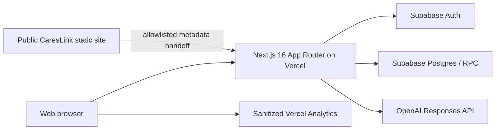

# CaresLink AI Architecture

> Status: **Current-state architecture**, audited 2026-08-14.
> Delivery phase: **Implementation Readiness / local Preview shadow slice**.
> This file does not claim that Product Baseline V1.0 is available in Production.

## Intended-state baseline

The approved product intent is defined by the planning-workspace files:

- `docs/2026-08-09-careslink-v1-product-baseline-approval.zh.md`
- `docs/2026-08-09-careslink-app-v1-requirements-review.zh.md`
- `docs/2026-08-09-careslink-ai-requirements-review.zh.md`

The requirement-by-requirement implementation assessment is in
`documentation/v1-implementation-readiness-audit.zh.md`.

## Current runtime

- Repository application: `apps/careslink-ai`
- Production host: `https://ai.careslink.com.au`
- Audited production code: `f0d994dfc66d7373bbadbe106b3147d847c6c8d3`
- Production Supabase project: `adocsnwnslxhxcjgbyee`
- Current clients: responsive Web only. There is no iOS or Android application in the audited repository.
- Current Production runtime API surface remains the Next.js route handlers under `src/app/api`. The local source now also contains a shared `/v1` route adapter, request-scoped Supabase adapter, service-only active-session resolver, atomic privacy-review confirmation boundary and versioned OpenAPI shadow contract. Both application gates are off by default; the runtime additionally requires an exact non-Production Preview Supabase ref before creating any privileged or user-session client. Privacy issuance uses a dedicated Preview-only service client and never falls back to the generic service-role variable. Document write-RPC grants remain withheld, and the flow has not been served or E2E-verified in Production.

## Current product domains

### Auth and roles

Supabase Auth provides email/password and feature-gated Google OAuth. The Web callback exchanges the PKCE code for a cookie-backed session. Application roles are read from trusted `app_metadata`; user-editable metadata is not accepted as an admin grant.

Current roles are `provider` and `admin`. Demo identities can exist only through the non-production demo flag. There is no Microsoft/Apple identity, identity-linking workflow, device/session registry, native SecureStore contract, or high-risk reauthentication service.

### AI Documents

The only production AI Note workflow is NDIS Case Note Companion:

1. Provider session is checked before request body parsing or cost-bearing work.
2. Browser performs a first privacy review; pasted source text stays in React state.
3. Server independently validates minimum facts, confirmations and obvious identifiers.
4. Server reserves one legacy credit and consumes account/IP abuse quota.
5. Server calls the OpenAI Responses API with strict structured output and `store:false`.
6. A short-lived opaque claim is persisted before the credit is committed.
7. The provider can save the result to `generated_material_drafts` and later read/delete it as owner.

This is a synchronous request flow. It is not a canonical document/revision model and has no durable generation job, editor checkpoint, self-review, DOCX/PDF/TXT export or cross-device outbox.

### Legacy provider and referral workspace

Profile, Readiness, referral materials, outreach and access-code capabilities remain in the same Web application. They are legacy Web domains and are not CaresLink App V1 entitlements. Their material types and access-code quota must remain isolated from the future personal Points wallet.

## Current data stores

| Store | Purpose | Current boundary |
|---|---|---|
| Supabase Auth | identities and sessions | trusted UUID and `app_metadata.role` |
| `generated_material_drafts` | flat saved AI/legacy material JSON | owner SELECT/DELETE; server save |
| `ndis_case_note_companion_claims` | opaque, short-lived generated-result handoff | service-role only; claim owner binding |
| `account_entitlements` | legacy free monthly allowance | owner SELECT; plan is currently `free` |
| `credit_ledger` | legacy grant/reserve/commit/release | append-only RPC writes; owner SELECT |
| `template_companion_quota_usage` | account/IP abuse counters | service-role only |
| `template_companion_events` | companion metadata telemetry | service-role only; no note body |
| provider/referral tables | legacy profile, access and outreach | server-owned paths with domain-specific checks |

All audited public tables have RLS enabled. RLS enabled alone is not proof of the V1 permission model: several target tables do not yet exist, and some legacy tables are accessed only through the service role.

## Implemented V1 shadow foundation

The first implementation-readiness batch is present in source but is deliberately inactive:

| Artifact | Implemented evidence | Runtime / deployment status |
|---|---|---|
| Versioned shared contract | `src/lib/v1/shared-contracts.ts` defines three locales, five Note codes/neutral fields, orthogonal states, service/rate codes, error codes and idempotency rules | only the audited NDIS save route may import the new integration entrypoint |
| Canonical document domain | `src/lib/v1/canonical-document-shadow.ts` models owner-bound documents, immutable revisions, stale-base rejection, checkpoints, revision-bound self-review and tombstone/purge transitions | memory-only test/reference implementation |
| Points domain | `src/lib/v1/points-shadow.ts` models wallets, lots, versioned quotes, source-lot allocation, reserve/commit/release and append-only ledger entries | memory-only test/reference implementation; legacy credits remain authoritative |
| Legacy NDIS adapter | `src/lib/v1/legacy-ndis-adapter.ts` projects existing saved NDIS material into a deterministic canonical snapshot and metadata-only migration candidate | read-only; no row is migrated or rewritten |
| Product API contract and route adapter | `contracts/careslink-v1-shadow.openapi.yaml`, `src/lib/v1/transport-contract.ts`, `src/lib/v1/product-api-runtime.server.ts`, `src/lib/v1/product-api-session-status.server.ts`, `src/lib/v1/product-api-supabase.server.ts` and route handlers under `src/app/v1` cover me, atomic privacy confirmation, documents, canonical revision append via `PATCH /v1/documents/{documentId}`, checkpoint, tombstone and canonical `GET /v1/sync/pull?cursor=`; `POST /v1/sync/push` is frozen only as an unserved `NOT_IMPLEMENTED` boundary, and five physical native-auth boundary routes return a fixed `501` | local durable adapter only; privacy confirmation canonicalises bounded cleaned structured facts, scans locator-only findings and sends no facts/token to its service-only RPC client. Mobile uses Bearer authentication, while Web cookie support is an additional shared-adapter transport. Both application gates are off by default, native capabilities remain compile-time `false`, runtime target verification permits only an explicitly matched non-Production Preview ref, and document writes are not granted. The protected historical Preview evidence is recorded in `documentation/tests.md`; nothing is currently Preview- or Production-served, and no Production or cross-device E2E claim is made |
| Mobile sync schema/RPC draft | `supabase/migrations/20260810131648_add_v1_mobile_sync_shadow.sql` plus `supabase/tests/v1_mobile_sync_shadow_assertions.sql` add service-only session status, session-checked owner reads, document mutations and the change feed | generated and source-tested only; migration is unapplied, only list/get/pull are drafted for authenticated execution, write-RPC grants remain withheld pending disposable-database canonical-hash vectors, and the SQL assertion file has not been executed |
| Points GRANT identity hardening draft | `supabase/migrations/20260810135000_harden_shadow_points_grant_identity.sql` isolates the ledger source-identity correction and service-only grant RPC | unapplied, not a cutover, and deliberately fail-closed until a non-empty database preflight is reviewed |
| Additive schema/RPC draft | `supabase/migrations/20260809120000_create_v1_shadow_foundation.sql` | applied and live-tested only on a disposable `with_data=false` Supabase branch; not applied to Production |
| NDIS integration migration | `supabase/migrations/20260809150000_create_ndis_shadow_preview_integration.sql` adds owner-bound links, metadata-only write outbox/read comparisons and four service-role RPCs, including delete tombstoning | applied and App-Preview-tested only on isolated non-default branches; Production is unchanged |
| Server repository/orchestrator | `ndis-shadow-repository.server.ts` and `ndis-shadow-integration.server.ts` project only after the legacy draft save succeeds | legacy response/content and monthly credits remain authoritative; shadow failure preserves that response and emits content-free evidence |
| Activation guard | master, dual-write, read and exact branch-ref checks in `ndis-shadow-guard.ts` | requires `VERCEL_ENV=preview`; known Production ref and every `VERCEL_ENV=production` execution fail closed |

The foundation migration creates only new shadow resources. The integration migration adds one composite uniqueness constraint to `generated_material_drafts(id, user_id)` so the source-owner foreign key is enforceable; it performs no legacy DML, backfill, entitlement change or content rewrite. Neither migration reads or changes `account_entitlements` or `credit_ledger`, issues a welcome grant, or changes production entitlement behavior. Every shadow business row is database-constrained to `shadow_only=true`. Authenticated grants are owner-only `SELECT` on the canonical owner resources; integration link/outbox/comparison tables expose no authenticated table grant. Shadow RPC execution is reserved to `service_role`. Cross-resource foreign keys bind owner and document identities to prevent same-ID/cross-owner composition errors.

Guarded-live evidence was collected on isolated branch ref `jtkicyqwdabhjzhdutve`, whose parent is the Production project but whose branch identity reported `with_data=false`. Two fresh applies succeeded. Legacy table row counts and column/constraint/policy/grant signatures matched before and after. Real password-grant JWTs proved provider A/B owner isolation, while a test-only platform service actor received no product-admin access. Positive Points mutations ran only as the database `service_role` through the five RPCs. After verification, all users/sessions/rows were cleared and the dedicated branch was deleted. This evidence validates the migration contract, not a served application flow.

The approved local integration slice hooks only the existing NDIS Save route and its owner Delete route. A successful `generated_material_drafts` write is projected through a service-role RPC into one canonical document. Mutation identity includes legacy source status, update time and creation generation; replay is accepted only while its revision is still current; same-content metadata updates remain revision-free; and changed content, including A→B→A, creates an immutable revision. The RPC takes a source-level advisory lock before row-locking and validating the current source, preventing an older request from overwriting a newer projection. NDIS canonical documents retain an owner-bound legacy-source generation identity, and owner RLS permits reading their document/revision/checkpoint only while that exact source generation exists. The Delete store atomically returns the deleted generation; the route keeps the legacy response authoritative and invokes a guarded, fail-safe service RPC that tombstones exactly that now owner-inaccessible canonical record. Replaying cleanup is write-free, and reusing the same legacy ID with a new `created_at` creates a separate canonical generation. Physical purge remains a later approved lifecycle action. Outbox and comparison rows contain IDs, timestamps, status, correlation ID and hashes only. There is no retry worker: the read-only reconciliation RPC derives missing/stale/failed work from the legacy source of truth and reports non-terminal legacy canonical rows with a missing source as `SOURCE_DELETE_CLEANUP_PENDING` for operator action.

The integration migration received a second guarded database run on disposable branch `qkciaecjwidtbujzwzln` (`with_data=false`, non-default, parent `adocsnwnslxhxcjgbyee`). Both migrations applied, the branch was reset to parent migration `20260804115230`, and both applied again. Transaction assertions passed twice. Live service-role calls proved one `PROJECTED` plus one `REPLAYED` result under same-idempotency concurrency, serialized distinct-content revisions 2 and 3, metadata-only `FAILED` reconciliation, and `MATCH`/`MISMATCH`/`MISSING` comparison states. Legacy credit and every Point table remained empty. Anonymous REST reads and RPCs were denied.

The later protected App Preview gate completed on non-default `with_data=false` branch `odrdlsrdlmtjczhmsbnj`. A parser-valid synthetic provider save preserved the legacy response while returning `PROJECTED`; metadata-only shadow-read returned `MATCH`; same-idempotency replay created no additional revision; provider B remained isolated; and a replacement Preview with the master flag disabled preserved legacy Save while creating no shadow work. No model call was made. An earlier parser-invalid fixture also exposed a projection-boundary observability gap; the integration now records the content-free code `PROJECTION_ERROR` without logging note content or changing the legacy response.

After the gate, every synthetic Auth/data object was verified at zero, all five test Preview deployments and six activation/test variables were removed, and Production alias/configuration remained unchanged. The owner deliberately retained the non-default branch as an inactive schema-only Preview baseline. Final pre-commit review subsequently hardened replay/CAS, correlation reuse, delete visibility and idempotency, source-generation reuse, pre-identity row repair, PURGED terminal-state preservation and missed delete-cleanup reconciliation. The then-current revisions of forward migrations `20260810072017_harden_ndis_shadow_projection_and_tombstone.sql`, `20260810072952_fail_close_legacy_ndis_shadow_identity.sql`, `20260810073519_preserve_purged_ndis_shadow_terminal_state.sql`, `20260810073929_reconcile_pending_ndis_delete_cleanup.sql` and `20260810080048_harden_ndis_shadow_tombstone_generations.sql` were then applied only to that retained branch. A real synthetic pre-corrective row was backfilled, an unidentifiable orphan was tombstoned and hidden, a simulated historical PURGED row remained terminal, a simulated missed tombstone appeared as metadata-only `SOURCE_DELETE_CLEANUP_PENDING` while remaining owner-hidden, and a same-ID/new-`created_at` generation remained independent from its immutable predecessor. Cleanup returned all counts to zero, and the then-current credential-free SQL assertion suites passed inside rollback transactions. The branch matched that migration registry with zero Auth, legacy, canonical and Point rows. Its base Preview URL and two existing branch keys remain configured, but the shadow activation flags are absent, so the application guard is off. Later catalog, active-provider/session and private-schema ACL hardening—including the current revision of `20260810080048`—has only source/contract-test evidence and has not been re-applied. The earlier protected App Preview is not evidence for the current hardened route and migration bundle.

The forward registry is evidence for the empty, flags-off branch path only. It is not an online-atomic upgrade contract for a database that already contains shadow rows: `20260810072017` and `20260810072952` commit separately, and the latter cannot prove restoration of a historical PURGED row's prior `updated_at` without a snapshot. Production promotion therefore requires zero-target-row preflight, flags off, snapshot, maintenance isolation and post-apply reconciliation, or a separately reviewed transactional/squashed plan when any target data exists.

## Trust boundaries

1. **Browser**: untrusted for authorization, quota, role and final privacy validation. Raw pasted notes are intended to remain in current React memory only.
2. **Next.js server**: authenticates and authorizes before parsing AI content or invoking quota/model work. It owns safe redirects and output validation.
3. **Supabase authenticated client**: may use only explicit owner policies. It cannot insert/update/delete the legacy credit ledger.
4. **Supabase service role**: server-only and high impact. Claims, quota, telemetry and credit RPC operations depend on this boundary.
5. **OpenAI**: receives only server-validated structured facts. `store:false` is configured; this must not be described as a contractual Zero Data Retention guarantee.
6. **Admin/support**: current product surfaces expose aggregate or metadata views, not a general note-body viewer.
7. **Core public site**: may send only allowlisted campaign/source metadata. It must not send email, user identity, form values, note text, token or private return URL.

## Current deployment and operations

- Vercel production is a Next.js server deployment; the AI subdomain is globally `noindex` so the Core public site remains the SEO canonical surface.
- Production Supabase migrations currently end at `20260804223000_create_ndis_case_note_pilot_cohort.sql`. All later V1 shadow migrations remain unapplied to Production; live applications of earlier reviewed revisions were limited to isolated guarded-live branches. The retained branch is clean and inactive but does not contain the exact current hardening revision.
- Pre-batch runtime baseline was 79 test files / 546 tests, and the completed implementation-readiness baseline was 90 files / 653 tests. The 2026-08-11 shared-contract snapshot passed 103 files / 831 tests. Current HEAD on 2026-08-14 passes 104 files / 894 tests, TypeScript, ESLint and a Next build with static generation 59/59. It includes atomic `POST /v1/privacy-reviews`, canonical `GET /v1/sync/pull?cursor=`, an unserved `POST /v1/sync/push` boundary, and four native-auth routes that physically return fixed `501` envelopes while their capabilities remain `false`. These current source results are not database execution, current serving or cross-device E2E evidence; the earlier protected Preview and cleanup outcome is recorded separately in `documentation/tests.md`, and the exact current migration hardening remains unapplied.
- Read-only production logs showed a recent cluster of invalid/missing refresh-token errors. Session recovery and stale-cookie cleanup require a separate release fix and negative tests before V1 rollout.

## Intended V1 architecture (not Production-available)

The approved target requires:

- one versioned Product API for Web/iOS/Android;
- a five-type Note catalog with per-type schema, privacy and safety versions;
- canonical documents, revisions, checkpoints, save acknowledgements, conflict handling and tombstones;
- asynchronous generation/transcription/export jobs;
- one Points wallet with lots, versioned rate catalog, quote/reserve/commit/release and unified entitlements;
- canonical Content API, Library state, Guides, Updates, Daily Brief, actions and notifications;
- provider-neutral Stripe/Apple/Google billing and receipt reconciliation;
- explicit `en`, `zh-Hans`, `zh-Hant` locale contracts;
- native encrypted storage/outbox and secure device session controls.

The contract/domain/schema portion and a feature-flagged NDIS dual-write/shadow-read application path now exist locally. Production schema/application activation remains absent. Isolated database and protected App Preview evidence for this second migration is tracked separately in `documentation/tests.md`.

## Known risks

- Legacy monthly credits conflict with approved one-time welcome Points and paid plan truth.
- Flat saved material JSON cannot meet revision, recovery or revision-bound export promises.
- `zh-Hant` is absent and must not silently fall back to `zh-Hans`.
- Service-role stores are secure only while every server route preserves auth/owner checks; V1 should narrow writes through domain RPCs.
- Existing real rows require snapshot, mapping and reconciliation; no in-place rewrite or destructive rollback is acceptable.
- The production refresh-token error cluster can create confusing recovery failures.
- Content currently lives as Core static repository content, not a versioned canonical Content API.
- The protected App Preview gate proved the guarded save projection, replay, comparison, owner isolation, failure observability and kill switch. It does not authorize Production schema, enablement or a user canary; those remain separate approval gates.
- Shadow retry is operator-driven reconciliation only; there is no queue worker, lease or scheduled retry.
- Supabase's fresh-branch performance advisor reported informational unindexed-foreign-key findings across the shadow schema. The Preview hot paths already have owner/source/update, status/update, owner/created and document/revision indexes; no mechanical bulk index addition was made. FK-cascade and larger-cohort plans must be reviewed before any Production migration, and unused-index findings on a fresh branch are not usage evidence.

## Email and scheduled work

There is no app-owned email delivery service, push service, queue worker, cron configuration or scheduled job in the audited AI application. Supabase Auth may send provider-managed authentication emails, but that is not an application email workflow. Therefore this audit does not create `emails.md` or `cron.md`.

## Related Documents

- `documentation/flows.md` - permission-sensitive runtime and shadow flows.
- `documentation/permissions.md` - current and unapplied shadow access matrix.
- `documentation/variables.md` - configuration and secret boundaries.
- `documentation/ndis-shadow-preview-runbook.md` - disposable branch/Preview verification and cleanup sequence.
- `documentation/tests.md` - existing, proposed and missing verification.
- `documentation/automation.md` - LLM/RPC automation and activation gates.
- `documentation/seo.md` - public Companion indexing boundary.
- `documentation/v1-implementation-readiness-audit.zh.md` - requirement map, implementation delta and approval gates.
- `documentation/prd.md` - historical NDIS pilot decision with V1 baseline precedence.
