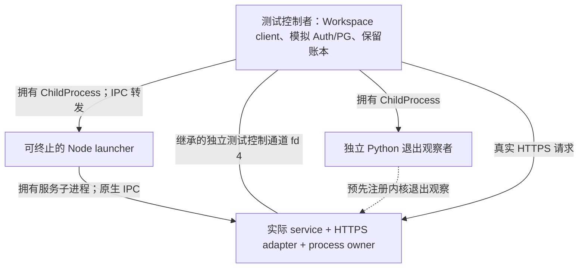

# QA Plan：Workspace/TLS 父进程终止与后继恢复

- 日期：2026-09-11
- 整理方式：仓库 `qa-plan` 工作流，按 CaresLink AI 范围调整
- 状态：13 项联合测试已实现并通过本地验证；五文件审阅完成，本批整理为本地提交，尚未发布
- 范围：一个集成功能，覆盖退出观测、保留账本恢复、Workspace/TLS 请求三个边界
- 引擎：未配置；本功能不涉及游戏引擎、UI 或视觉验收

## 基线与来源

- [PR #46](https://github.com/Millionluna/Codex-Game-Studios/pull/46) 已合并到 `codex/careslink-ai-documents-v1-auth-gate`。
- 当前合并提交：`d9bdec51855234f1559113f6681a96672a9e3f20`。
- 文件树：`8ff8323a855df4c9833bcd5ad471ff9b68a3ad32`，与已审阅的 `dad443d` 相同。
- 已有本地证据：相关进程测试 39 项通过、1 项既有跳过；全套 6,241 项通过、54 项跳过。这些是基线结果，不是本方案的新测试结果。
- 本次没有找到该功能对应的独立 story、GDD 或 ADR 引用；验收条件来自已批准的下一步和 M1Y 交接。仓库也没有 `design/gdd/systems-index.md` 或 `docs/architecture/control-manifest.md`，不据此虚构额外规则。

源码依据（路径均相对于 `apps/careslink-ai/`）：

| 文件 | 当前提供的依据 |
|---|---|
| `src/lib/communication-note-workspace-task-https.process.test.ts` | 真实 TLS 请求、Workspace handler、模拟 Auth/PG、控制者保留的租约 Map；已有提交后中断、恢复先于监听、旧 instance 拒绝测试 |
| `scripts/preview-e2e/communication-note-task-https-local-child.mjs` | 实际 service、HTTPS adapter 和 process owner；broker 经父子 IPC 请求模拟账本，IPC 丢失后拒绝未完成调用 |
| `src/lib/communication-note-task-process-observation.process.test.ts` | 独立观察者、父进程实际退出、身份核验、通道关闭，以及严格的后继启动检查 |
| `scripts/preview-e2e/communication-note-task-process-observer.py` | macOS `kqueue` 退出事件；不发送信号，不提供孤儿进程退出码或数据库清理证明 |
| `src/lib/communication-note-task-preview-issuer.server.ts` | `recover()` 执行 `start → inventory → fence/finalize → ready`；恢复失败时禁止 issue |
| `src/lib/communication-note-task-preview-service.server.ts` | `start()` 等待实际 issuer 恢复；`stop()` 的清理确认来自 drain 结果 |
| `src/lib/communication-note-task-preview-https.server.ts` | 等待 service 启动成功才创建监听；停止时关闭 admission、取消请求并等待 listener/drain |
| `src/lib/communication-note-task-preview-host.server.ts` | 原生 IPC disconnect 触发停止；强制退出不构成清理确认 |
| `documentation/communication-note-product-integration-m1y.md` | 已有证据、平台限制及尚未验证的真实环境边界 |

## 分类与测试分配

| 验证范围 | 类型 | 自动化要求 | 人工核对 |
|---|---|---|---|
| 父进程终止、服务退出、后继启动限制 | Integration | 实际进程、IPC、内核事件及资源关闭断言 | 核对退出证据和信号目标 |
| 非空账本恢复先于监听 | Integration | 保留 Map，阻塞恢复检查点，观察实际服务状态与监听 | 核对没有清空账本或合成成功结果 |
| 旧实例拒绝、新请求成功 | Integration | 真实签名和 HTTPS、Workspace 响应及撤销断言 | 核对身份、TLS 与模拟 PG 的界限 |

不需要 UI 截图、玩家试玩或视觉签字；人工检查只用于复核自动化证据。

## 测试拓扑与关键决定



控制者 R 在本轮父进程终止测试中始终存活。模拟账本由 R 持有，在旧服务和后继之间保留同一个 Map；只有整个测试用例结束后才可清空。它只模拟跨 launcher/service 生命周期保留的状态，不证明控制者或宿主机崩溃后的持久性。

最小改动采用 **broker 继续经 launcher 的原生 IPC 转发** 的方案。launcher 终止时，旧服务实际丢失 broker 通路；即使 R 仍保留账本，旧服务也不能再访问它。fd 4 仅承担测试身份、生命周期观察和检查点释放，不能偷偷成为备用 broker，也不能代写清理成功。

这意味着旧服务可能以 `FAILED / cleanupConfirmed=false` 结束，而保留的租约仍为 `ISSUED` 或 `FENCED`。后继必须通过自己的新 IPC 通路运行实际 issuer 恢复。采用以下两个独立条件：

1. **允许启动恢复进程**：旧 launcher 已实际退出并关闭；预注册观察者已核验旧服务身份，收到匹配的内核退出事件并正常关闭；旧测试控制通道和所有旧 HTTPS 请求已实际关闭；证据通道无错误；旧 broker RPC 已失败或结清，不能在后继启动后修改新一代状态。此时可启动一次新进程用于恢复，尚无请求监听。
2. **允许接收新请求**：新进程使用新 epoch，实际执行完整恢复；保留的旧租约全部 `REVOKED`，模拟角色、会话、成员关系计数均为零；实际 `ready` 回复成功且服务健康，随后才出现真实 HTTPS 监听并发布新 instance 绑定。

PR #46 的原有 `successor()` 严格检查保持不变：清理未确认仍不得通过该检查。新联合夹具使用单独命名、明确用途的恢复启动检查，不能将它冒充已清理的服务启动许可，也不能事后把旧服务的失败改写为成功。此区分依据现有 issuer/service/HTTPS 的恢复先于监听行为；本批通过下面的正、反向联合测试验证了上述本地行为，实际环境的监督和数据库清理仍未验证。

退出或身份证据不确定时，连恢复进程也不得启动。任何恢复操作失败都不得监听；一次失败不自动升级为反复重启。为清理测试资源而另建的观察者只能用于收尾，不能替换原观察者的失效证据。

## 验收条件与用例矩阵

实际新测试文件：`src/lib/communication-note-workspace-task-parent-exit.process.test.ts`。已实现并通过 **13 项进程集成测试**；PE-01 至 PE-07 均有本地运行证据，结果记录见下文。

| ID | 触发与观察点 | 必须断言 | 实际项数 |
|---|---|---|---:|
| PE-01 | 正常 launcher `exit(0)` / 实际 SIGKILL，分别发生于真实请求触发的 `ISSUE_COMMITTED` / `FENCE_COMMITTED` 检查点 | 原请求返回 503 且没有 `taskPage`；旧服务失去真实 IPC 并关闭监听；原 Map 保留非空 `ISSUED` / `FENCED`；确认内核退出与资源关闭后才启动后继；新 epoch 恢复旧租约后才监听；旧 instance 请求被拒绝；新绑定请求成功并独立撤销 | 4 |
| PE-02 | 保留旧服务退出检查点：已获 IPC EOF、端口拒绝或 owner finished，但服务仍活着 | 经独立测试通道的新身份挑战证明服务仍存活；恢复启动检查拒绝；只释放明确退出检查点才可能继续，超时不算成功 | 1 |
| PE-03 | 原观察者零超时 / 通过 owned handle 实际 SIGKILL | 无后继启动、无后继 broker `start`、无新监听；即使收尾观察者随后确认旧服务退出，也保持原判断失败 | 2 |
| PE-04 | 有效 owner 消息之后，在真实测试控制流注入损坏帧 | 通道错误保持失败；即使内核退出、资源关闭和既有有效消息均存在，也不得启动恢复进程 | 1 |
| PE-05 | 后继分别在 `inventory`、`finalize`、`ready` 注入受控失败 | 不发布 ready/instance 绑定，不出现 HTTPS listener，不执行新 issue；保留恢复失败证据，不能手动清空 Map 后放行 | 3 |
| PE-06 | 旧代 RPC 回复被明确暂停，launcher 退出后才释放 | 回复不能进入新代 pending 表、不能修改新 epoch 或满足新请求；旧请求失败、旧通道关闭后才进行后继恢复 | 1 |
| PE-07 | 开启测试 Preview flags，走正式 route，并扫描产品导入 | `HOSTED_WORKSPACE_READ_BINDING` 仍 undefined；正式 route 仍拒绝；产品代码不导入新增夹具、观察者或测试 helper | 1 |

PE-01 的每个参数组合均须覆盖完整链路，不能用一次普通重启用例替代父进程死亡后的旧 instance 拒绝和新请求成功。

具体断言要求：

- 父进程终止前预注册观察者，再通过原 IPC 挑战 `nonce + service PID + parent PID`。正常退出与 SIGKILL 均使用明确的 launcher 句柄；不能用预先 `disconnect()` 代替父进程死亡。
- `ISSUE_COMMITTED` / `FENCE_COMMITTED` 必须先由真实请求驱动模拟协议状态提交，再报告检查点；后继前不能用手工插入或重新播种租约替代这份遗留状态。
- 每代 RPC 使用独立待回复表和实例身份。旧代关停后拒绝所有迟到调用/回复，取消或结清其处理任务；不能让延迟的旧 `start` 改写后继 epoch。
- 在后继 `inventory` 尚未释放以及 `finalize` 尚未确认时，断言 `address()` 未提供地址、健康状态未 READY、实际进程没有 HTTPS listener、新 issue 次数为零。阻塞点应短于实际 broker/服务期限；不靠长 sleep 或延长生产超时获得成功。
- 成功恢复后，检查 `start → inventory → fence/finalize → ready → listen` 的因果顺序、epoch 改变和旧租约归零。保留原 Map 中 REVOKED 项，不能用空数组或 `Map.clear()` 证明清理。
- 将携带旧 instance 的合法签名请求发送到**后继的新监听地址**，保持正确 CA/SPKI/SNI/ALPN 条件，断言 503、无 `taskPage`、无新 issue。只请求已关闭的旧端口无法证明 instance 校验。
- 对同一后继使用新 instance 绑定，断言 Workspace 返回 200、返回合成用户对应的任务；真实 HTTPS issue/revoke 均完成，撤销回复确认前不能返回成功元数据。
- 对实际 Workspace reader 的模拟 PG 对象仍检查 `end`、stream destroy、密码引用清除；这些是调用与对象生命周期证据，不是物理 PostgreSQL 会话清理证明。

## 实现范围与顺序

本批已从 `d9bdec5` 创建 `codex/careslink-workspace-task-parent-exit` 分支。

| 本批文件与复用范围 | 工作内容 |
|---|---|
| 新 `scripts/preview-e2e/communication-note-task-parent-exit-local-child.mjs` | 明确 launcher/service 角色；最少量 IPC 转发、独立测试控制通道；组合现有实际 service/HTTPS/owner；只支持固定测试输入 |
| 新 `src/lib/communication-note-workspace-task-parent-exit.process.test.ts` | 新拓扑、保留账本、原观察者证据、恢复启动检查与上述矩阵 |
| 现有 Python observer | 优先直接复用，不复制内核观测实现 |
| 现有 Workspace/TLS 测试 | 保持原文件及其 25 项测试不变；新套件沿用其合成证书、固定地址、模拟账本和 Workspace harness 写法，调用同一批实际产品模块；本批未抽取共享 helper |
| 现有 `src/lib/communication-note-task-preview-https.server.test.ts` | 自主停止用例等待实际服务端 `finish` 及其 Promise continuation 后再停止服务；保留 STOPPED、清理确认与禁止重启断言 |
| 本计划与 M1Y 交接 | 记录实现后的实际结果、失败边界和下一步 |

先建立检查点和失败断言，再连接实际进程。先完成一个非空账本的完整恢复链，再展开正常退出/SIGKILL 与 issue/fence 参数；随后覆盖证据失效、恢复失败、迟到回复和产品边界。

本批以测试侧改动为目标，不预设需要修改生产模块。如果真实组合暴露生产逻辑缺陷，应保留失败证据并明确具体修复范围，不能替换实际模块或削弱断言使测试变绿。

## 验证命令与收尾要求

以下命令已完成本地验证。工作目录为 `apps/careslink-ai/`：

```sh
env -u CARESLINK_TASK_ISSUER_LOCAL_SOCKET node node_modules/vitest/vitest.mjs run src/lib/communication-note-workspace-task-parent-exit.process.test.ts src/lib/communication-note-workspace-task-https.process.test.ts src/lib/communication-note-task-process-observation.process.test.ts src/lib/communication-note-task-preview-host.process.test.ts src/lib/communication-note-task-preview-https.server.test.ts
env -u CARESLINK_TASK_ISSUER_LOCAL_SOCKET node node_modules/vitest/vitest.mjs run
node node_modules/typescript/bin/tsc --noEmit --incremental false
node node_modules/eslint/bin/eslint.js src/lib/communication-note-workspace-task-parent-exit.process.test.ts src/lib/communication-note-task-preview-https.server.test.ts scripts/preview-e2e/communication-note-task-parent-exit-local-child.mjs
```

若抽取额外 helper，也将其列入变更文件 Lint。仓库根目录执行 `python3 tools/sync_codex_adapters.py --check` 和 `git diff --check`。仅测试/文档变化时沿用未变更生产树的构建证据；若生产实现或依赖改变，则重新完成相应 build/client-boundary 检查。

新联合套件明确限 macOS；其他平台报告未验证，不能把跳过当作通过，也不扩大既有 POSIX 套件的跳过范围。

资源收尾必须覆盖启动中途失败、断言失败和观察者丢失：

- 进程一创建便登记 owned handle；未知服务身份或未完成退出观察保持未验证，不能提前宣称收尾成功。
- 关闭并等待真实 HTTPS 请求、TLS socket、控制通道、观察者和 launcher 的资源事件；孤儿服务退出由匹配内核事件确认，不能伪造 Node `close`。
- fixture watchdog 或强制终止始终记作失败，不补写清理确认。只通过自建进程句柄发送信号，不按端口或未经核验的 PID 清理。
- 测试证书、私钥和 bundle 放在唯一自建临时目录；密钥 Buffer 用后清理，日志只记录脱敏的状态/身份摘要。相关进程和资源实际完成收尾后才删除该目录。
- 若无法完成收尾，报告未确认对象和受控临时目录，保持测试失败；不得删除证据后报告成功。

## 人工 QA 与 smoke 核对

- 核对所有故障都发生在自建 launcher/观察者，实际 service 使用的仍是仓库模块。
- 核对每个矩阵行有可追溯的自动化结果，事件来源清晰；没有将模拟 SQL、测试控制消息或端口关闭当成内核退出证明。
- smoke 顺序：旧服务真实请求并产生租约 → launcher 终止 → 旧请求失败/资源关闭 → 独立退出确认 → 后继非空恢复且未监听 → 恢复完成后监听 → 旧 instance 拒绝 → 新请求成功并撤销。
- 核对无剩余测试进程、监听器或证书，并检查所有失败用例不会误开新 listener。
- 核对正式 route 默认拒绝及产品 import guard；人工记录只引用合成数据和本地测试日志。

## 完成定义与仍未验证的范围

- [x] PE-01 至 PE-07 均有真实运行证据；所列失败注入均拒绝对应启动或监听。
- [x] 原有最小探针、Workspace/TLS 和 host 测试保持通过；相关与全套结果准确区分通过/跳过/未验证。
- [x] 类型、变更文件 Lint、适配器同步及差异检查通过。
- [x] 测试资源收尾完成，M1Y 交接更新为实际结果。
- [x] 五文件代码审阅完成，审阅结论随本批本地提交保存。
- [x] 不把旧服务未知清理改成成功；新进程仅在其自身恢复完成后接收请求。

### 2026-09-11 本地实施结果

- 四个正常退出/SIGKILL × issue/fence 提交点组合均通过完整链路。旧 owner 的 `FAILED / cleanupConfirmed=false` 保留；内核退出确认与旧资源关闭后，新进程执行真实 issuer 恢复。
- 后继分别暂停在 inventory 和已提交 finalize 的回复之前；前者保留非空旧状态，后者账本已归零但 ready 尚未发生，两处实际进程均未监听。释放回复后才出现新监听。
- 合法旧 instance 断言到达后继的真实 TLS 地址并被拒绝；新绑定请求返回合成任务，实际 HTTPS 撤销回复到达前不会返回成功元数据。
- 原观察者超时/被杀、真实损坏帧、恢复操作失败和迟到旧回复均覆盖；收尾观察者不会代替原观察者证据。PR #46 的原严格后继检查、原 25 项 Workspace/TLS 测试和生产模块未修改。
- 首轮全套出现两项失败：新端口探测早于 listener 关闭完成，以及既有自主停止测试早于服务端响应发送完成。分别改为等待实际 owner 完成事件、实际 `ServerResponse.finish` 及其 continuation 后再触发后续操作；未接受 ECONNRESET 作为关闭成功，也未放宽原有状态断言。
- 最终相关测试 **102 项通过、1 项既有跳过**；全套 **6,254 项通过、54 项跳过**，323 个测试文件通过、5 个跳过。TypeScript、变更文件 ESLint、73 个适配器同步检查通过。最终全套开始于本机 20:06:42，用时 18.31 秒。
- 本批共 5 个文件：3 个新增文件（本计划、联合测试、进程夹具），以及既有 HTTPS 测试和 M1Y 交接。本地提交包含以下审阅记录；尚未推送或创建 PR。

### 2026-09-11 代码审阅

按仓库 `code-review` 工作流逐项本地审阅上述五文件，并核对实际 issuer/service/HTTPS/owner 和复用观察者的相关实现。审阅结论为 **APPROVED WITH SUGGESTIONS**：没有必须修复项。

| 审阅项 | 结果 |
|---|---|
| 引擎专家 / 游戏循环 | 未配置引擎；本批为 Node 测试工具，不涉及帧率、玩法或 UI |
| 可测试性 | PE-01 至 PE-07 对应 13 项测试；正常退出、SIGKILL、仍存活服务、失效观察者、损坏证据、恢复失败和迟到回复均有明确断言 |
| ADR | 计划、目标文件头和相关提交信息未找到 ADR 引用，跳过 ADR 符合性检查 |
| 通用编码规范 | 未新增产品公开接口；固定合成值集中于测试工厂，沿用本应用 Vitest 命名。模拟协议和恢复启动检查的分支较多，未满足通用“复杂度小于 10”的建议，列为可读性建议，不宣称六项全部通过 |
| 架构 / SOLID | 产品模块不反向依赖夹具；fd 4 无 broker 功能；旧服务清理失败、恢复进程启动许可和新 HTTPS 监听许可保持分离；未发现新的职责或依赖方向问题 |
| 资源收尾 | owned handle 创建后登记；原观察者证据不能被收尾观察者替换；通道失败保持失败；旧 RPC/request/wire 阻止提前恢复；未确认服务退出时保留临时目录并使测试失败 |
| 证据优点 | 保留同一非空账本；在实际恢复回复前断言没有监听；合法旧 instance 请求到达新 TLS 地址后仍被拒绝；既有 HTTPS 测试的等待来自真实 finish 事件 |
| 必须修改 / 建议 | 无必须修改项。后续若继续扩展矩阵，可给恢复启动检查中的证据类别命名，并评估提取重复 harness；无需为本批引入独立重构 |

复核了相关 102 项通过 / 1 项跳过及全套 6,254 项通过 / 54 项跳过的既有最终日志。此次审阅仅补充文档，未改动已验证的测试或产品代码，因此不重复执行全套；提交前重新检查适配器同步、五文件差异和源工作树状态。

持续边界：Auth、SQL、角色/会话/成员关系计数和账本仍是显式模拟；不重试被阻止的 PG16 fixture，不创建替代 Preview，不操作真实数据库角色/迁移、IAM、安装密钥、护理数据、真实 AI、Points/支付或生产部署。所有 readiness 标志保持 false，`HOSTED_WORKSPACE_READ_BINDING` 保持 undefined。

本方案不覆盖 Linux/Windows 的退出观察、真实 PostgreSQL 持久性与物理清理、父端主动 `ChildProcess.disconnect()` 的既有关闭事件缺口、控制者/宿主机同时死亡、真实工作负载/密钥来源或已部署的监督系统。它也不构成 Hosted 激活依据。

**下一步：** 将本批已审阅的本地提交推送到 `Millionluna/Codex-Game-Studios` 的 `codex/careslink-workspace-task-parent-exit` 分支，并以 `codex/careslink-ai-documents-v1-auth-gate` 为基线创建草稿 PR；发布另行执行。
